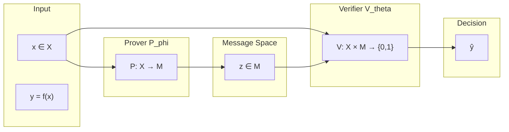
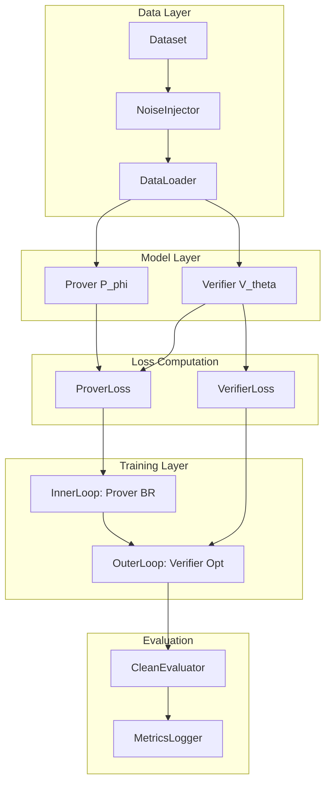

# Noisy Prover-Verifier Games: Comprehensive Implementation Guide

## Document Purpose

This guide provides exhaustive implementation details for building the Noisy Prover-Verifier Games (PVG) experimental framework. It is written for researchers who understand the game-theoretic foundations but need precise guidance on translating theory into working code.

---

## Part 1: Theoretical Foundations and System Context

### 1.1 The Prover-Verifier Game Framework

The Prover-Verifier Game is a two-player signaling game where:



**Critical distinction from standard supervised learning**: The verifier receives BOTH the input `x` AND the prover's message `z`. The prover's message is a "proof" or "explanation" that the verifier can use to make its decision.

### 1.2 Why Stackelberg, Not Nash

This project uses **Stackelberg equilibrium** (bilevel optimization), not Nash equilibrium. Understanding this distinction is crucial for correct implementation:

| Aspect | Nash Equilibrium | Stackelberg Equilibrium |

|--------|------------------|-------------------------|

| **Timing** | Simultaneous moves | Sequential: leader then follower |

| **Information** | Neither player observes the other | Follower observes leader's strategy |

| **Optimization** | Fixed-point: both best-respond simultaneously | Bilevel: leader optimizes anticipating follower's best response |

| **In our setup** | Would require simultaneous gradient descent | Verifier leads, prover best-responds |

**Rationale**: In the PVG setting, the verifier is deployed first (its parameters are fixed), and then the prover optimizes against it. This matches real-world scenarios where a verification system exists and provers adapt to it.

**Mathematical formulation**:

```
θ* = argmin_θ L_V(θ, φ*(θ))    # Verifier optimizes reduced objective
φ*(θ) = argmin_φ L_P(θ, φ)     # Prover best-responds to any θ
```

This is NOT equivalent to:

```
# WRONG: Nash-style simultaneous optimization
θ* = argmin_θ L_V(θ, φ)
φ* = argmin_φ L_P(θ, φ)
```

### 1.3 The Noise Model

Label noise is symmetric (class-conditional flip probability):

```
P(ỹ = 1 | y = 0) = ε    (false positive noise)
P(ỹ = 0 | y = 1) = ε    (false negative noise)
```

**Key insight**: Under symmetric noise, the effective label becomes:

```python
y_eff = (1 - 2*eps) * y + eps
```

This means:

- At ε = 0: y_eff = y (clean labels)
- At ε = 0.5: y_eff = 0.5 (pure noise, no information)
- The "effective signal" scales linearly: (1 - 2ε)

**Why symmetric noise?** It preserves the class-conditional structure and admits cleaner theoretical analysis. Asymmetric noise is a potential extension but complicates equilibrium characterization.

### 1.4 Anil vs. Kirchner Setup

The codebase follows **Anil et al.'s setup** (single prover defending label 1), NOT Kirchner's setup:

| Aspect | Anil et al. (2021) | Kirchner et al. (2024) |

|--------|-------------------|------------------------|

| **Prover type** | Single prover, always defends y=1 | Two provers: helpful and sneaky |

| **Prover loss** | L_P = -log p_θ(ŷ=1|x,z) | Different for helpful/sneaky |

| **Training** | Bilevel Stackelberg | RL with PPO |

| **Scale** | Theoretical/toy | LLM-scale (GPT-4 class) |

**Rationale for Anil's setup**: Simpler to analyze theoretically and sufficient for studying the primary hypothesis about equilibrium sensitivity to noise.

---

## Part 2: System Architecture

### 2.1 Project Structure

```
prover-verifier-game-with-noise/
├── AGENTS.md                    # Project context for AI assistants
├── pvg_empirical_experiments_guide.md
│
├── src/
│   ├── __init__.py
│   ├── models.py               # Prover/Verifier model definitions
│   ├── losses.py               # Loss function implementations
│   ├── training.py             # Stackelberg training loop
│   ├── noise.py                # Noise injection utilities
│   ├── metrics.py              # Evaluation metrics
│   └── utils.py                # Seeding, logging, device management
│
├── experiments/
│   ├── synthetic/
│   │   ├── linear_f2.py        # Linear equations over F_2
│   │   ├── bec.py              # Binary erasure channel
│   │   └── configs/            # Hyperparameter configs
│   │
│   ├── nlp/
│   │   ├── snli_binary.py      # SNLI entailment task
│   │   ├── fever_binary.py     # FEVER fact verification
│   │   └── configs/
│   │
│   └── math_reasoning/
│       ├── gsm8k_pvg.py        # GSM8K with PVG training
│       └── configs/
│
├── notebooks/
│   ├── 01_synthetic_experiments.ipynb
│   ├── 02_nlp_experiments.ipynb
│   └── 03_analysis_plots.ipynb
│
├── tests/
│   ├── test_losses.py
│   ├── test_training.py
│   └── test_noise.py
│
├── requirements.txt
└── README.md
```

### 2.2 Data Flow Architecture



### 2.3 Configuration System

Use `@dataclass` for type-safe, self-documenting configs:

```python
from dataclasses import dataclass, field
from typing import Literal, Optional
import torch

@dataclass
class ExperimentConfig:
    """Master configuration for PVG experiments."""
    
    # Experiment identification
    experiment_name: str
    seed: int = 42
    
    # Noise parameters
    epsilon: float = 0.0  # Label flip probability
    
    # Training parameters
    num_rounds: int = 100         # Outer loop iterations
    prover_steps_per_round: int = 10   # K_P in algorithm
    verifier_steps_per_round: int = 5  # K_V in algorithm
    
    # Optimization
    prover_lr: float = 1e-4
    verifier_lr: float = 1e-4
    batch_size: int = 64
    
    # Model selection
    tier: Literal["synthetic", "nlp", "math"] = "synthetic"
    
    # Logging
    log_every: int = 10
    eval_every: int = 50
    checkpoint_every: int = 100
    
    # Device
    device: str = field(default_factory=lambda: "cuda" if torch.cuda.is_available() else "cpu")

@dataclass  
class SyntheticConfig(ExperimentConfig):
    """Config for Tier 1 synthetic experiments."""
    tier: Literal["synthetic"] = "synthetic"
    
    # Problem-specific
    n_vars: int = 10          # Number of variables in linear system
    n_equations: int = 15     # Number of equations
    dataset_size: int = 10000
    
    # Model architecture
    hidden_dim: int = 128
    message_dim: int = 64     # Dimension of prover's message space
    num_layers: int = 2

@dataclass
class NLPConfig(ExperimentConfig):
    """Config for Tier 2 NLP experiments."""
    tier: Literal["nlp"] = "nlp"
    
    # Dataset
    dataset_name: Literal["snli", "fever"] = "snli"
    max_seq_length: int = 128
    
    # Models
    prover_model: str = "distilbert-base-uncased"
    verifier_model: str = "distilbert-base-uncased"
    
    # Message format
    message_max_length: int = 64

@dataclass
class MathConfig(ExperimentConfig):
    """Config for Tier 3 math reasoning experiments."""
    tier: Literal["math"] = "math"
    
    # Models
    prover_model: str = "gpt2"
    verifier_model: str = "distilbert-base-uncased"
    
    # Generation
    max_proof_length: int = 256
    temperature: float = 0.7
    
    # RL training
    ppo_epochs: int = 4
    kl_penalty: float = 0.1
```

---

## Part 3: Core Module Implementations

### 3.1 Noise Injection (`src/noise.py`)

```python
"""
Noise injection utilities for label corruption.

The noise model is symmetric: P(flip) = ε for both classes.
This preserves the theoretical property that y_eff = (1-2ε)y + ε.
"""

import torch
from typing import Union

def inject_label_noise(
    labels: torch.Tensor,
    epsilon: float,
    generator: torch.Generator = None
) -> torch.Tensor:
    """
    Flip binary labels with probability epsilon.
    
    Args:
        labels: Tensor of shape (batch_size,) with values in {0, 1}
        epsilon: Flip probability in [0, 0.5)
        generator: Optional random generator for reproducibility
    
    Returns:
        Noisy labels with same shape as input
    
    Mathematical note:
        E[ỹ | y] = (1-ε)y + ε(1-y) = (1-2ε)y + ε
        So the "effective label" under noise is a soft label.
    """
    if epsilon < 0 or epsilon >= 0.5:
        raise ValueError(f"epsilon must be in [0, 0.5), got {epsilon}")
    
    if epsilon == 0:
        return labels.clone()
    
    # Generate flip mask
    flip_mask = torch.rand(
        labels.shape, 
        device=labels.device,
        generator=generator
    ) < epsilon
    
    # XOR to flip: label ^ flip_mask
    noisy_labels = labels ^ flip_mask.long()
    
    return noisy_labels


def compute_effective_label(y: torch.Tensor, epsilon: float) -> torch.Tensor:
    """
    Compute the effective soft label under symmetric noise.
    
    Under symmetric noise with flip probability ε:
        y_eff = (1 - 2ε) * y + ε
    
    This is useful for:
    1. Understanding gradient behavior
    2. Implementing soft-label training variants
    3. Theoretical analysis
    """
    return (1 - 2 * epsilon) * y.float() + epsilon


class NoiseScheduler:
    """
    Schedule noise level during training.
    
    Use cases:
    1. Curriculum learning: start clean, gradually add noise
    2. Annealing: start noisy, reduce over time
    3. Cyclic: alternate between noise levels
    """
    
    def __init__(
        self,
        schedule_type: str = "constant",
        epsilon_start: float = 0.0,
        epsilon_end: float = 0.0,
        warmup_steps: int = 0,
        total_steps: int = 1000
    ):
        self.schedule_type = schedule_type
        self.epsilon_start = epsilon_start
        self.epsilon_end = epsilon_end
        self.warmup_steps = warmup_steps
        self.total_steps = total_steps
    
    def get_epsilon(self, step: int) -> float:
        if self.schedule_type == "constant":
            return self.epsilon_start
        
        elif self.schedule_type == "linear":
            if step < self.warmup_steps:
                return self.epsilon_start
            progress = (step - self.warmup_steps) / (self.total_steps - self.warmup_steps)
            return self.epsilon_start + progress * (self.epsilon_end - self.epsilon_start)
        
        elif self.schedule_type == "cosine":
            import math
            progress = min(step / self.total_steps, 1.0)
            return self.epsilon_end + 0.5 * (self.epsilon_start - self.epsilon_end) * (1 + math.cos(math.pi * progress))
        
        else:
            raise ValueError(f"Unknown schedule type: {self.schedule_type}")
```

### 3.2 Loss Functions (`src/losses.py`)

```python
"""
Loss functions for Prover-Verifier Games.

CRITICAL: These follow Anil et al.'s setup where the prover ALWAYS defends label 1.
This is different from Kirchner et al.'s helpful/sneaky prover setup.

Loss definitions:
    L_V(θ, φ) = E[-ỹ log p_θ(x,z) - (1-ỹ) log(1-p_θ(x,z))]  # Verifier: standard CE
    L_P(θ, φ) = E[-log p_θ(x,z)]                              # Prover: maximize prob of 1
"""

import torch
import torch.nn.functional as F
from typing import Tuple, Optional

def verifier_loss(
    verifier_logits: torch.Tensor,
    noisy_labels: torch.Tensor,
    reduction: str = "mean"
) -> torch.Tensor:
    """
    Compute verifier loss (cross-entropy with potentially noisy labels).
    
    Args:
        verifier_logits: Raw logits from verifier, shape (batch_size,) or (batch_size, 2)
        noisy_labels: Binary labels (possibly corrupted), shape (batch_size,)
        reduction: "mean", "sum", or "none"
    
    Returns:
        Cross-entropy loss
    
    Note: The verifier trains on noisy labels ỹ, not ground truth y.
    The equilibrium deviation we study comes from this noise.
    """
    # Handle both single-logit and two-class logit formats
    if verifier_logits.dim() == 1 or verifier_logits.shape[-1] == 1:
        # Binary cross-entropy with logits
        logits = verifier_logits.squeeze(-1)
        return F.binary_cross_entropy_with_logits(
            logits, 
            noisy_labels.float(),
            reduction=reduction
        )
    else:
        # Standard cross-entropy for 2-class output
        return F.cross_entropy(
            verifier_logits, 
            noisy_labels.long(),
            reduction=reduction
        )


def prover_loss(
    verifier_logits: torch.Tensor,
    reduction: str = "mean"
) -> torch.Tensor:
    """
    Compute prover loss (always defends label 1).
    
    In Anil et al.'s setup, the prover's goal is to maximize p_θ(ŷ=1|x,z),
    equivalently minimize -log p_θ(ŷ=1|x,z).
    
    Args:
        verifier_logits: Raw logits from verifier
        reduction: "mean", "sum", or "none"
    
    Returns:
        Negative log probability of label 1
    
    Mathematical note:
        L_P = -log σ(s_θ(x,z)) = -log p_θ(ŷ=1|x,z)
        where σ is sigmoid and s_θ is the verifier's score function.
    """
    if verifier_logits.dim() == 1 or verifier_logits.shape[-1] == 1:
        # For single logit: -log(sigmoid(logit)) = softplus(-logit)
        logits = verifier_logits.squeeze(-1)
        loss = F.softplus(-logits)  # Numerically stable -log(sigmoid(x))
    else:
        # For two-class: -log(softmax[1])
        log_probs = F.log_softmax(verifier_logits, dim=-1)
        loss = -log_probs[:, 1]  # Negative log prob of class 1
    
    if reduction == "mean":
        return loss.mean()
    elif reduction == "sum":
        return loss.sum()
    else:
        return loss


def compute_prover_reward(
    verifier_logits: torch.Tensor,
) -> torch.Tensor:
    """
    Compute prover reward for RL-based training.
    
    Reward = log p_θ(ŷ=1|x,z) = -L_P
    
    For PPO/GRPO training, we need rewards not losses.
    """
    return -prover_loss(verifier_logits, reduction="none")


class StackelbergLoss:
    """
    Combined loss computation for Stackelberg training.
    
    Provides a unified interface for computing both losses
    and tracking their components.
    """
    
    def __init__(self, epsilon: float = 0.0):
        self.epsilon = epsilon
    
    def __call__(
        self,
        verifier_logits: torch.Tensor,
        true_labels: torch.Tensor,
        inject_noise: bool = True
    ) -> Tuple[torch.Tensor, torch.Tensor, dict]:
        """
        Compute both prover and verifier losses.
        
        Args:
            verifier_logits: Output of verifier given (x, z)
            true_labels: Ground truth labels (before noise)
            inject_noise: Whether to add label noise
        
        Returns:
            Tuple of (prover_loss, verifier_loss, metrics_dict)
        """
        from .noise import inject_label_noise
        
        # Inject noise for verifier training
        if inject_noise and self.epsilon > 0:
            noisy_labels = inject_label_noise(true_labels, self.epsilon)
        else:
            noisy_labels = true_labels
        
        # Compute losses
        L_P = prover_loss(verifier_logits)
        L_V = verifier_loss(verifier_logits, noisy_labels)
        
        # Compute clean loss for monitoring (evaluation metric)
        L_V_clean = verifier_loss(verifier_logits, true_labels)
        
        # Accuracy metrics
        with torch.no_grad():
            if verifier_logits.dim() == 1 or verifier_logits.shape[-1] == 1:
                preds = (verifier_logits.squeeze(-1) > 0).long()
            else:
                preds = verifier_logits.argmax(dim=-1)
            
            accuracy = (preds == true_labels).float().mean()
            prover_success = preds.float().mean()  # Rate of predicting 1
        
        metrics = {
            "prover_loss": L_P.item(),
            "verifier_loss_noisy": L_V.item(),
            "verifier_loss_clean": L_V_clean.item(),
            "accuracy": accuracy.item(),
            "prover_success_rate": prover_success.item(),
            "noise_level": self.epsilon,
        }
        
        return L_P, L_V, metrics
```

### 3.3 Model Definitions (`src/models.py`)

```python
"""
Prover and Verifier model architectures.

Architecture philosophy:
- Prover: Maps input x to message z (proof/explanation)
- Verifier: Maps (x, z) to binary decision

The models are decoupled so they can be independently varied
across experimental tiers.
"""

import torch
import torch.nn as nn
from typing import Optional, Tuple
from abc import ABC, abstractmethod

# ===========================================================================
# Abstract Base Classes
# ===========================================================================

class BaseProver(nn.Module, ABC):
    """Abstract base class for all Prover models."""
    
    @abstractmethod
    def forward(self, x: torch.Tensor) -> torch.Tensor:
        """Generate message z given input x."""
        pass
    
    @abstractmethod
    def sample(self, x: torch.Tensor) -> torch.Tensor:
        """Sample a message (for stochastic provers)."""
        pass


class BaseVerifier(nn.Module, ABC):
    """Abstract base class for all Verifier models."""
    
    @abstractmethod
    def forward(self, x: torch.Tensor, z: torch.Tensor) -> torch.Tensor:
        """Produce logits given input x and message z."""
        pass


# ===========================================================================
# Tier 1: Synthetic Task Models
# ===========================================================================

class MLPProver(BaseProver):
    """
    MLP-based prover for synthetic tasks.
    
    Maps flattened input x to a continuous message vector z.
    The message space is a bounded hypercube [-1, 1]^message_dim.
    """
    
    def __init__(
        self,
        input_dim: int,
        hidden_dim: int = 128,
        message_dim: int = 64,
        num_layers: int = 2,
        dropout: float = 0.1
    ):
        super().__init__()
        
        layers = []
        in_dim = input_dim
        for _ in range(num_layers - 1):
            layers.extend([
                nn.Linear(in_dim, hidden_dim),
                nn.ReLU(),
                nn.Dropout(dropout)
            ])
            in_dim = hidden_dim
        
        layers.append(nn.Linear(in_dim, message_dim))
        layers.append(nn.Tanh())  # Bound messages to [-1, 1]
        
        self.network = nn.Sequential(*layers)
        self.message_dim = message_dim
    
    def forward(self, x: torch.Tensor) -> torch.Tensor:
        x_flat = x.view(x.shape[0], -1)
        return self.network(x_flat)
    
    def sample(self, x: torch.Tensor) -> torch.Tensor:
        # Deterministic for MLP prover
        return self.forward(x)


class MLPVerifier(BaseVerifier):
    """
    MLP-based verifier for synthetic tasks.
    
    Concatenates input x and message z, then classifies.
    """
    
    def __init__(
        self,
        input_dim: int,
        message_dim: int,
        hidden_dim: int = 128,
        num_layers: int = 2,
        dropout: float = 0.1
    ):
        super().__init__()
        
        layers = []
        in_dim = input_dim + message_dim
        for _ in range(num_layers - 1):
            layers.extend([
                nn.Linear(in_dim, hidden_dim),
                nn.ReLU(),
                nn.Dropout(dropout)
            ])
            in_dim = hidden_dim
        
        layers.append(nn.Linear(in_dim, 1))  # Binary output
        
        self.network = nn.Sequential(*layers)
    
    def forward(self, x: torch.Tensor, z: torch.Tensor) -> torch.Tensor:
        x_flat = x.view(x.shape[0], -1)
        combined = torch.cat([x_flat, z], dim=-1)
        return self.network(combined).squeeze(-1)


# ===========================================================================
# Tier 2: NLP Task Models
# ===========================================================================

class TransformerProver(BaseProver):
    """
    Transformer-based prover for NLP tasks.
    
    Uses a pretrained encoder to produce a dense message vector
    from the input text.
    """
    
    def __init__(
        self,
        model_name: str = "distilbert-base-uncased",
        message_dim: int = 256,
        freeze_encoder: bool = False
    ):
        super().__init__()
        from transformers import AutoModel, AutoTokenizer
        
        self.encoder = AutoModel.from_pretrained(model_name)
        self.tokenizer = AutoTokenizer.from_pretrained(model_name)
        
        if freeze_encoder:
            for param in self.encoder.parameters():
                param.requires_grad = False
        
        hidden_size = self.encoder.config.hidden_size
        self.projection = nn.Sequential(
            nn.Linear(hidden_size, message_dim),
            nn.Tanh()
        )
        self.message_dim = message_dim
    
    def forward(self, input_ids: torch.Tensor, attention_mask: torch.Tensor) -> torch.Tensor:
        outputs = self.encoder(input_ids=input_ids, attention_mask=attention_mask)
        # Use [CLS] token representation
        cls_output = outputs.last_hidden_state[:, 0, :]
        return self.projection(cls_output)
    
    def sample(self, input_ids: torch.Tensor, attention_mask: torch.Tensor) -> torch.Tensor:
        return self.forward(input_ids, attention_mask)


class TransformerVerifier(BaseVerifier):
    """
    Transformer-based verifier for NLP tasks.
    
    Takes input text and prover message, produces binary classification.
    """
    
    def __init__(
        self,
        model_name: str = "distilbert-base-uncased",
        message_dim: int = 256,
        freeze_encoder: bool = False
    ):
        super().__init__()
        from transformers import AutoModel, AutoTokenizer
        
        self.encoder = AutoModel.from_pretrained(model_name)
        self.tokenizer = AutoTokenizer.from_pretrained(model_name)
        
        if freeze_encoder:
            for param in self.encoder.parameters():
                param.requires_grad = False
        
        hidden_size = self.encoder.config.hidden_size
        # Classifier takes [CLS] representation + message
        self.classifier = nn.Sequential(
            nn.Linear(hidden_size + message_dim, hidden_size),
            nn.ReLU(),
            nn.Dropout(0.1),
            nn.Linear(hidden_size, 1)
        )
    
    def forward(
        self,
        input_ids: torch.Tensor,
        attention_mask: torch.Tensor,
        message: torch.Tensor
    ) -> torch.Tensor:
        outputs = self.encoder(input_ids=input_ids, attention_mask=attention_mask)
        cls_output = outputs.last_hidden_state[:, 0, :]
        combined = torch.cat([cls_output, message], dim=-1)
        return self.classifier(combined).squeeze(-1)


# ===========================================================================
# Tier 3: LLM Models (Generative Prover)
# ===========================================================================

class LLMProver(BaseProver):
    """
    LLM-based prover that generates text proofs.
    
    The "message" is a sequence of tokens (chain-of-thought).
    This requires different handling than vector messages.
    """
    
    def __init__(
        self,
        model_name: str = "gpt2",
        max_length: int = 256,
        temperature: float = 0.7
    ):
        super().__init__()
        from transformers import AutoModelForCausalLM, AutoTokenizer
        
        self.model = AutoModelForCausalLM.from_pretrained(model_name)
        self.tokenizer = AutoTokenizer.from_pretrained(model_name)
        self.tokenizer.pad_token = self.tokenizer.eos_token
        
        self.max_length = max_length
        self.temperature = temperature
    
    def forward(self, input_ids: torch.Tensor, attention_mask: torch.Tensor) -> torch.Tensor:
        """Return hidden states (for value head if using PPO)."""
        outputs = self.model(
            input_ids=input_ids,
            attention_mask=attention_mask,
            output_hidden_states=True
        )
        return outputs.hidden_states[-1][:, -1, :]
    
    def sample(
        self,
        input_ids: torch.Tensor,
        attention_mask: torch.Tensor
    ) -> Tuple[torch.Tensor, torch.Tensor]:
        """Generate proof text autoregressively."""
        outputs = self.model.generate(
            input_ids=input_ids,
            attention_mask=attention_mask,
            max_new_tokens=self.max_length,
            temperature=self.temperature,
            do_sample=True,
            pad_token_id=self.tokenizer.pad_token_id,
            return_dict_in_generate=True,
            output_scores=True
        )
        return outputs.sequences, outputs.scores
    
    def decode(self, token_ids: torch.Tensor) -> list:
        """Decode token IDs to text."""
        return self.tokenizer.batch_decode(token_ids, skip_special_tokens=True)


class LLMVerifier(BaseVerifier):
    """
    Verifier for text-based proofs from LLM prover.
    
    Encodes (problem, proof) pair and produces binary classification.
    """
    
    def __init__(
        self,
        model_name: str = "distilbert-base-uncased",
        max_length: int = 512
    ):
        super().__init__()
        from transformers import AutoModelForSequenceClassification, AutoTokenizer
        
        self.model = AutoModelForSequenceClassification.from_pretrained(
            model_name, num_labels=2
        )
        self.tokenizer = AutoTokenizer.from_pretrained(model_name)
        self.max_length = max_length
    
    def forward(
        self,
        problem_text: list,
        proof_text: list
    ) -> torch.Tensor:
        """
        Classify (problem, proof) pairs.
        
        Args:
            problem_text: List of problem strings
            proof_text: List of proof/solution strings
        
        Returns:
            Logits of shape (batch_size, 2)
        """
        # Concatenate problem and proof with separator
        combined = [f"{p} [SEP] {z}" for p, z in zip(problem_text, proof_text)]
        
        inputs = self.tokenizer(
            combined,
            padding=True,
            truncation=True,
            max_length=self.max_length,
            return_tensors="pt"
        ).to(self.model.device)
        
        outputs = self.model(**inputs)
        return outputs.logits


# ===========================================================================
# Model Factory
# ===========================================================================

def create_models(config) -> Tuple[BaseProver, BaseVerifier]:
    """
    Factory function to create prover-verifier pair based on config.
    """
    if config.tier == "synthetic":
        # Calculate input dimension from problem parameters
        input_dim = config.n_equations * (config.n_vars + 1)  # A matrix + b vector
        
        prover = MLPProver(
            input_dim=input_dim,
            hidden_dim=config.hidden_dim,
            message_dim=config.message_dim,
            num_layers=config.num_layers
        )
        verifier = MLPVerifier(
            input_dim=input_dim,
            message_dim=config.message_dim,
            hidden_dim=config.hidden_dim,
            num_layers=config.num_layers
        )
    
    elif config.tier == "nlp":
        prover = TransformerProver(
            model_name=config.prover_model,
            message_dim=config.message_max_length
        )
        verifier = TransformerVerifier(
            model_name=config.verifier_model,
            message_dim=config.message_max_length
        )
    
    elif config.tier == "math":
        prover = LLMProver(
            model_name=config.prover_model,
            max_length=config.max_proof_length,
            temperature=config.temperature
        )
        verifier = LLMVerifier(
            model_name=config.verifier_model
        )
    
    else:
        raise ValueError(f"Unknown tier: {config.tier}")
    
    return prover, verifier
```

### 3.4 Training Loop (`src/training.py`)

```python
"""
Stackelberg training loop for Prover-Verifier Games.

CRITICAL IMPLEMENTATION DETAIL:
This is BILEVEL optimization, not simultaneous gradient descent.

Algorithm structure:
    for each round:
        1. Prover best-responds to current verifier (inner loop)
        2. Verifier optimizes against prover's best response (outer loop)

The order matters! Verifier leads, prover follows.
"""

import torch
from torch.optim import AdamW
from torch.utils.data import DataLoader
from typing import Optional, Callable, Dict
import logging
from tqdm import tqdm

from .losses import StackelbergLoss, prover_loss, verifier_loss
from .noise import inject_label_noise
from .metrics import MetricsTracker

logger = logging.getLogger(__name__)


class StackelbergTrainer:
    """
    Trainer for Prover-Verifier Games using Stackelberg dynamics.
    
    Key design decisions:
    1. Prover fully converges (or K_P steps) before verifier updates
    2. Verifier sees prover's current best response
    3. Clean evaluation metrics tracked separately from training losses
    """
    
    def __init__(
        self,
        prover: torch.nn.Module,
        verifier: torch.nn.Module,
        config,
        train_loader: DataLoader,
        eval_loader: Optional[DataLoader] = None,
    ):
        self.prover = prover
        self.verifier = verifier
        self.config = config
        self.train_loader = train_loader
        self.eval_loader = eval_loader
        
        # Optimizers
        self.prover_optimizer = AdamW(
            prover.parameters(),
            lr=config.prover_lr,
            weight_decay=0.01
        )
        self.verifier_optimizer = AdamW(
            verifier.parameters(),
            lr=config.verifier_lr,
            weight_decay=0.01
        )
        
        # Loss computation
        self.loss_fn = StackelbergLoss(epsilon=config.epsilon)
        
        # Metrics tracking
        self.metrics = MetricsTracker()
        
        # Device
        self.device = torch.device(config.device)
        self.prover.to(self.device)
        self.verifier.to(self.device)
    
    def train(self) -> Dict:
        """
        Main training loop implementing Stackelberg dynamics.
        
        Returns:
            Dictionary of training history
        """
        logger.info(f"Starting training with ε={self.config.epsilon}")
        
        for round_t in range(self.config.num_rounds):
            # ===== Step 1: Prover best-response (inner loop) =====
            self.verifier.eval()  # Freeze verifier
            self.prover.train()
            
            prover_losses = []
            for _ in range(self.config.prover_steps_per_round):
                batch = next(iter(self.train_loader))
                p_loss = self._prover_step(batch)
                prover_losses.append(p_loss)
            
            # ===== Step 2: Verifier optimization (outer loop) =====
            self.prover.eval()  # Freeze prover (use its best response)
            self.verifier.train()
            
            verifier_losses = []
            for _ in range(self.config.verifier_steps_per_round):
                batch = next(iter(self.train_loader))
                v_loss = self._verifier_step(batch)
                verifier_losses.append(v_loss)
            
            # ===== Logging =====
            if round_t % self.config.log_every == 0:
                self._log_round(round_t, prover_losses, verifier_losses)
            
            # ===== Evaluation =====
            if round_t % self.config.eval_every == 0 and self.eval_loader:
                eval_metrics = self.evaluate()
                self.metrics.log_eval(round_t, eval_metrics)
            
            # ===== Checkpointing =====
            if round_t % self.config.checkpoint_every == 0:
                self._save_checkpoint(round_t)
        
        return self.metrics.get_history()
    
    def _prover_step(self, batch) -> float:
        """
        Single prover optimization step.
        
        Prover minimizes L_P = -log p_θ(ŷ=1|x,z)
        i.e., maximizes probability verifier outputs 1
        """
        x, y = self._unpack_batch(batch)
        
        # Generate message
        z = self.prover.sample(x)
        
        # Get verifier's prediction (detached - don't backprop through verifier)
        with torch.no_grad():
            verifier_logits = self.verifier(x, z)
        
        # Wait, we need gradients through the prover!
        # Re-compute with gradient flow through prover
        z = self.prover.sample(x)  # Need fresh forward pass
        verifier_logits = self.verifier(x, z)
        
        # Compute prover loss
        loss = prover_loss(verifier_logits)
        
        # Backprop through prover only
        self.prover_optimizer.zero_grad()
        loss.backward()
        torch.nn.utils.clip_grad_norm_(self.prover.parameters(), 1.0)
        self.prover_optimizer.step()
        
        return loss.item()
    
    def _verifier_step(self, batch) -> float:
        """
        Single verifier optimization step.
        
        Verifier minimizes L_V = CE(p_θ(x,z), ỹ) with noisy labels
        """
        x, y = self._unpack_batch(batch)
        
        # Inject label noise
        noisy_y = inject_label_noise(y, self.config.epsilon)
        
        # Get prover's message (detached - prover is frozen)
        with torch.no_grad():
            z = self.prover.sample(x)
        
        # Verifier forward pass
        verifier_logits = self.verifier(x, z)
        
        # Compute verifier loss on noisy labels
        loss = verifier_loss(verifier_logits, noisy_y)
        
        # Backprop through verifier only
        self.verifier_optimizer.zero_grad()
        loss.backward()
        torch.nn.utils.clip_grad_norm_(self.verifier.parameters(), 1.0)
        self.verifier_optimizer.step()
        
        return loss.item()
    
    def _unpack_batch(self, batch):
        """Unpack batch and move to device."""
        if isinstance(batch, dict):
            x = batch['input'].to(self.device)
            y = batch['label'].to(self.device)
        else:
            x, y = batch
            x = x.to(self.device)
            y = y.to(self.device)
        return x, y
    
    def evaluate(self) -> Dict:
        """
        Evaluate on clean labels (no noise injection).
        
        This measures the TRUE performance of the learned equilibrium,
        separate from the noisy training objective.
        """
        self.prover.eval()
        self.verifier.eval()
        
        total_loss = 0
        total_correct = 0
        total_samples = 0
        total_prover_success = 0
        
        with torch.no_grad():
            for batch in self.eval_loader:
                x, y = self._unpack_batch(batch)
                
                z = self.prover.sample(x)
                logits = self.verifier(x, z)
                
                # Clean loss (no noise)
                loss = verifier_loss(logits, y, reduction="sum")
                total_loss += loss.item()
                
                # Accuracy
                if logits.dim() == 1:
                    preds = (logits > 0).long()
                else:
                    preds = logits.argmax(dim=-1)
                
                total_correct += (preds == y).sum().item()
                total_prover_success += preds.sum().item()
                total_samples += len(y)
        
        return {
            "clean_loss": total_loss / total_samples,
            "accuracy": total_correct / total_samples,
            "prover_success_rate": total_prover_success / total_samples
        }
    
    def _log_round(self, round_t, prover_losses, verifier_losses):
        """Log training progress."""
        avg_p_loss = sum(prover_losses) / len(prover_losses)
        avg_v_loss = sum(verifier_losses) / len(verifier_losses)
        
        logger.info(
            f"Round {round_t}: P_loss={avg_p_loss:.4f}, V_loss={avg_v_loss:.4f}"
        )
        
        self.metrics.log_train(round_t, {
            "prover_loss": avg_p_loss,
            "verifier_loss": avg_v_loss
        })
    
    def _save_checkpoint(self, round_t):
        """Save model checkpoint."""
        checkpoint = {
            "round": round_t,
            "prover_state": self.prover.state_dict(),
            "verifier_state": self.verifier.state_dict(),
            "prover_optimizer": self.prover_optimizer.state_dict(),
            "verifier_optimizer": self.verifier_optimizer.state_dict(),
            "config": self.config,
            "metrics": self.metrics.get_history()
        }
        path = f"checkpoints/{self.config.experiment_name}_round{round_t}.pt"
        torch.save(checkpoint, path)
        logger.info(f"Saved checkpoint to {path}")


# ===========================================================================
# Alternative: PPO-based Training for LLM Provers
# ===========================================================================

class PPOStackelbergTrainer:
    """
    PPO-based training for LLM-scale experiments.
    
    Uses TRL library for stable RL fine-tuning.
    The prover is trained with PPO where reward = log p_θ(ŷ=1|x,z)
    """
    
    def __init__(
        self,
        prover,
        verifier,
        config,
        train_dataset
    ):
        from trl import PPOTrainer, PPOConfig
        
        self.prover = prover
        self.verifier = verifier
        self.config = config
        
        # PPO configuration
        ppo_config = PPOConfig(
            model_name=config.prover_model,
            learning_rate=config.prover_lr,
            batch_size=config.batch_size,
            mini_batch_size=config.batch_size // 4,
            ppo_epochs=config.ppo_epochs,
            kl_penalty=config.kl_penalty
        )
        
        self.ppo_trainer = PPOTrainer(
            model=prover.model,
            config=ppo_config,
            tokenizer=prover.tokenizer
        )
        
        self.verifier_optimizer = AdamW(
            verifier.model.parameters(),
            lr=config.verifier_lr
        )
    
    def train_round(self, batch):
        """Single round of PPO training."""
        problems = batch['problem']
        true_labels = batch['label']
        
        # Generate proofs
        query_tensors = self.prover.tokenizer(
            problems, return_tensors="pt", padding=True
        )
        response_tensors, _ = self.prover.sample(
            query_tensors['input_ids'],
            query_tensors['attention_mask']
        )
        proofs = self.prover.decode(response_tensors)
        
        # Compute rewards from verifier
        with torch.no_grad():
            verifier_logits = self.verifier(problems, proofs)
            rewards = torch.softmax(verifier_logits, dim=-1)[:, 1]
        
        # PPO step for prover
        self.ppo_trainer.step(
            query_tensors['input_ids'],
            response_tensors,
            rewards.tolist()
        )
        
        # Update verifier on noisy labels
        noisy_labels = inject_label_noise(true_labels, self.config.epsilon)
        verifier_logits = self.verifier(problems, proofs)
        v_loss = verifier_loss(verifier_logits, noisy_labels)
        
        self.verifier_optimizer.zero_grad()
        v_loss.backward()
        self.verifier_optimizer.step()
        
        return {
            "prover_reward": rewards.mean().item(),
            "verifier_loss": v_loss.item()
        }
```

---

## Part 4: Experimental Implementations by Tier

### 4.1 Tier 1: Synthetic Linear Equations

```python
"""
experiments/synthetic/linear_f2.py

Linear equations over F_2 (binary field).
This is a natural PVG problem where:
- x = (A, b) is a linear system
- y = 1 if system is satisfiable, 0 otherwise
- Prover can send a "witness" (candidate solution)
"""

import numpy as np
import torch
from torch.utils.data import Dataset, DataLoader
from typing import Tuple

def gaussian_elimination_f2(A: np.ndarray, b: np.ndarray) -> Tuple[bool, np.ndarray]:
    """
    Gaussian elimination over F_2 to check satisfiability.
    
    Returns:
        (is_satisfiable, solution_if_exists)
    """
    A = A.copy().astype(np.int64)
    b = b.copy().astype(np.int64)
    n_eq, n_var = A.shape
    
    # Augmented matrix
    aug = np.hstack([A, b.reshape(-1, 1)])
    
    pivot_row = 0
    for col in range(n_var):
        # Find pivot
        pivot_found = False
        for row in range(pivot_row, n_eq):
            if aug[row, col] == 1:
                aug[[pivot_row, row]] = aug[[row, pivot_row]]
                pivot_found = True
                break
        
        if not pivot_found:
            continue
        
        # Eliminate
        for row in range(n_eq):
            if row != pivot_row and aug[row, col] == 1:
                aug[row] = (aug[row] + aug[pivot_row]) % 2
        
        pivot_row += 1
    
    # Check consistency
    for row in range(pivot_row, n_eq):
        if aug[row, -1] == 1:  # 0 = 1 contradiction
            return False, None
    
    # Back-substitute for a solution
    solution = np.zeros(n_var, dtype=np.int64)
    for row in range(min(pivot_row, n_eq) - 1, -1, -1):
        col = np.argmax(aug[row, :n_var])
        if aug[row, col] == 1:
            solution[col] = (aug[row, -1] - np.dot(aug[row, :n_var], solution)) % 2
    
    return True, solution


class LinearF2Dataset(Dataset):
    """
    Dataset of linear systems over F_2.
    
    Each sample is ((A, b), y) where:
    - A: n_equations x n_vars binary matrix
    - b: n_equations binary vector
    - y: 1 if satisfiable, 0 otherwise
    """
    
    def __init__(
        self,
        n_samples: int,
        n_vars: int = 10,
        n_equations: int = 15,
        seed: int = 42
    ):
        np.random.seed(seed)
        
        self.samples = []
        for _ in range(n_samples):
            A = np.random.randint(0, 2, (n_equations, n_vars))
            b = np.random.randint(0, 2, n_equations)
            
            is_sat, _ = gaussian_elimination_f2(A, b)
            
            # Flatten and concatenate for model input
            x = np.concatenate([A.flatten(), b])
            y = int(is_sat)
            
            self.samples.append((
                torch.tensor(x, dtype=torch.float32),
                torch.tensor(y, dtype=torch.long)
            ))
    
    def __len__(self):
        return len(self.samples)
    
    def __getitem__(self, idx):
        return self.samples[idx]


def run_synthetic_experiment(config):
    """Run full synthetic experiment."""
    from src.models import create_models
    from src.training import StackelbergTrainer
    
    # Create dataset
    train_dataset = LinearF2Dataset(
        n_samples=config.dataset_size,
        n_vars=config.n_vars,
        n_equations=config.n_equations,
        seed=config.seed
    )
    eval_dataset = LinearF2Dataset(
        n_samples=config.dataset_size // 10,
        n_vars=config.n_vars,
        n_equations=config.n_equations,
        seed=config.seed + 1
    )
    
    train_loader = DataLoader(train_dataset, batch_size=config.batch_size, shuffle=True)
    eval_loader = DataLoader(eval_dataset, batch_size=config.batch_size)
    
    # Create models
    prover, verifier = create_models(config)
    
    # Train
    trainer = StackelbergTrainer(
        prover=prover,
        verifier=verifier,
        config=config,
        train_loader=train_loader,
        eval_loader=eval_loader
    )
    
    history = trainer.train()
    
    return history
```

### 4.2 Tier 2: NLP Binary Classification

```python
"""
experiments/nlp/snli_binary.py

Binary NLI task using SNLI dataset.
- Entailment (label 0) → y = 1
- Non-entailment (labels 1, 2) → y = 0

The PVG interpretation:
- x = (premise, hypothesis) pair
- z = prover's explanation/rationale
- y = whether hypothesis follows from premise
"""

from datasets import load_dataset
import torch
from torch.utils.data import DataLoader
from transformers import AutoTokenizer

def prepare_snli_binary(split: str = "train", max_samples: int = None):
    """Load and binarize SNLI dataset."""
    dataset = load_dataset("stanfordnlp/snli", split=split)
    
    # Filter out examples with label -1 (no gold label)
    dataset = dataset.filter(lambda x: x['label'] != -1)
    
    # Binarize: entailment (0) → 1, contradiction/neutral (1,2) → 0
    def binarize(example):
        example['binary_label'] = 1 if example['label'] == 0 else 0
        return example
    
    dataset = dataset.map(binarize)
    
    if max_samples:
        dataset = dataset.select(range(min(max_samples, len(dataset))))
    
    return dataset


class SNLICollator:
    """Collator for batching SNLI examples."""
    
    def __init__(self, tokenizer, max_length: int = 128):
        self.tokenizer = tokenizer
        self.max_length = max_length
    
    def __call__(self, batch):
        premises = [ex['premise'] for ex in batch]
        hypotheses = [ex['hypothesis'] for ex in batch]
        labels = torch.tensor([ex['binary_label'] for ex in batch])
        
        # Tokenize premise-hypothesis pairs
        encodings = self.tokenizer(
            premises,
            hypotheses,
            padding=True,
            truncation=True,
            max_length=self.max_length,
            return_tensors='pt'
        )
        
        return {
            'input_ids': encodings['input_ids'],
            'attention_mask': encodings['attention_mask'],
            'label': labels,
            'premise': premises,
            'hypothesis': hypotheses
        }


def run_snli_experiment(config):
    """Run SNLI binary classification experiment."""
    from src.models import TransformerProver, TransformerVerifier
    from src.training import StackelbergTrainer
    
    # Load data
    train_data = prepare_snli_binary("train", max_samples=50000)
    eval_data = prepare_snli_binary("validation", max_samples=5000)
    
    # Tokenizer for collation
    tokenizer = AutoTokenizer.from_pretrained(config.prover_model)
    collator = SNLICollator(tokenizer, config.max_seq_length)
    
    train_loader = DataLoader(
        train_data, 
        batch_size=config.batch_size,
        shuffle=True,
        collate_fn=collator
    )
    eval_loader = DataLoader(
        eval_data,
        batch_size=config.batch_size,
        collate_fn=collator
    )
    
    # Models
    prover = TransformerProver(
        model_name=config.prover_model,
        message_dim=config.message_max_length
    )
    verifier = TransformerVerifier(
        model_name=config.verifier_model,
        message_dim=config.message_max_length
    )
    
    # Adapt trainer for transformer inputs
    # (would need to modify StackelbergTrainer._unpack_batch)
    trainer = StackelbergTrainer(
        prover=prover,
        verifier=verifier,
        config=config,
        train_loader=train_loader,
        eval_loader=eval_loader
    )
    
    return trainer.train()
```

### 4.3 Tier 3: Math Reasoning with LLMs

```python
"""
experiments/math_reasoning/gsm8k_pvg.py

GSM8K math problem solving with PVG framework.
- x = math problem (text)
- z = chain-of-thought solution (generated text)
- y = correctness of final numerical answer

This follows Kirchner et al.'s setup but with noise injection.
"""

from datasets import load_dataset
import re
import torch

def extract_gsm8k_answer(answer_text: str) -> float:
    """Extract numerical answer from GSM8K format."""
    # GSM8K uses #### to mark the final answer
    if '####' in answer_text:
        answer = answer_text.split('####')[-1].strip()
    else:
        # Fallback: find last number
        numbers = re.findall(r'-?\d+\.?\d*', answer_text)
        answer = numbers[-1] if numbers else "0"
    
    # Clean and convert
    answer = answer.replace(',', '').strip()
    try:
        return float(answer)
    except:
        return 0.0


def check_answer_correctness(prediction: str, ground_truth: str) -> bool:
    """Check if predicted answer matches ground truth."""
    pred_num = extract_gsm8k_answer(prediction)
    true_num = extract_gsm8k_answer(ground_truth)
    return abs(pred_num - true_num) < 1e-5


class GSM8KDataset(torch.utils.data.Dataset):
    """GSM8K dataset for PVG training."""
    
    def __init__(self, split: str = "train"):
        dataset = load_dataset("openai/gsm8k", "main", split=split)
        
        self.problems = []
        self.solutions = []
        self.answers = []
        
        for ex in dataset:
            self.problems.append(ex['question'])
            self.solutions.append(ex['answer'])
            self.answers.append(extract_gsm8k_answer(ex['answer']))
    
    def __len__(self):
        return len(self.problems)
    
    def __getitem__(self, idx):
        return {
            'problem': self.problems[idx],
            'solution': self.solutions[idx],
            'answer': self.answers[idx]
        }


def create_gsm8k_prompt(problem: str) -> str:
    """Create prompt for prover to generate solution."""
    return f"""Solve this math problem step by step. Show your work and end with the numerical answer.

Problem: {problem}

Solution:"""


def run_gsm8k_experiment(config):
    """
    Run GSM8K experiment with PPO-based training.
    
    This uses RL to train the prover because:
    1. Prover output is discrete (text)
    2. Reward is non-differentiable (correctness)
    3. Need to explore solution space
    """
    from src.models import LLMProver, LLMVerifier
    from src.training import PPOStackelbergTrainer
    
    # Load data
    train_data = GSM8KDataset("train")
    eval_data = GSM8KDataset("test")
    
    # Models
    prover = LLMProver(
        model_name=config.prover_model,
        max_length=config.max_proof_length,
        temperature=config.temperature
    )
    verifier = LLMVerifier(
        model_name=config.verifier_model
    )
    
    # Training
    trainer = PPOStackelbergTrainer(
        prover=prover,
        verifier=verifier,
        config=config,
        train_dataset=train_data
    )
    
    # Custom training loop for GSM8K
    from torch.utils.data import DataLoader
    train_loader = DataLoader(train_data, batch_size=config.batch_size, shuffle=True)
    
    history = []
    for epoch in range(config.num_rounds):
        for batch in train_loader:
            # Create binary labels: does prover's solution lead to correct answer?
            problems = batch['problem']
            true_answers = batch['answer']
            
            # Generate proofs
            prompts = [create_gsm8k_prompt(p) for p in problems]
            query_tensors = prover.tokenizer(prompts, return_tensors="pt", padding=True)
            proof_tensors, _ = prover.sample(
                query_tensors['input_ids'].to(config.device),
                query_tensors['attention_mask'].to(config.device)
            )
            proofs = prover.decode(proof_tensors)
            
            # Check correctness (ground truth labels)
            labels = torch.tensor([
                int(check_answer_correctness(proof, str(ans)))
                for proof, ans in zip(proofs, true_answers)
            ])
            
            # Inject noise
            from src.noise import inject_label_noise
            noisy_labels = inject_label_noise(labels, config.epsilon)
            
            # Train verifier on (problem, proof, noisy_label)
            verifier_logits = verifier(problems, proofs)
            from src.losses import verifier_loss
            v_loss = verifier_loss(verifier_logits, noisy_labels)
            
            # Train prover with PPO
            with torch.no_grad():
                rewards = torch.softmax(verifier_logits, dim=-1)[:, 1]
            
            trainer.ppo_trainer.step(
                query_tensors['input_ids'],
                proof_tensors,
                rewards.tolist()
            )
            
            history.append({
                'epoch': epoch,
                'verifier_loss': v_loss.item(),
                'prover_reward': rewards.mean().item(),
                'clean_accuracy': (labels == 1).float().mean().item()
            })
    
    return history
```

---

## Part 5: Experimental Sweep and Analysis

### 5.1 Noise Level Sweep

```python
"""
experiments/sweep_noise_levels.py

Main experiment: sweep over noise levels and measure equilibrium deviation.
"""

import json
from pathlib import Path
from typing import List, Dict
import matplotlib.pyplot as plt
import numpy as np

def run_noise_sweep(
    base_config,
    noise_levels: List[float] = [0.0, 0.05, 0.1, 0.15, 0.2, 0.25, 0.3, 0.35, 0.4, 0.45],
    seeds: List[int] = [42, 123, 456]
) -> Dict:
    """
    Run experiments across noise levels and seeds.
    
    Returns aggregated results for analysis.
    """
    results = {}
    
    for eps in noise_levels:
        results[eps] = []
        
        for seed in seeds:
            # Update config
            config = base_config
            config.epsilon = eps
            config.seed = seed
            config.experiment_name = f"noise_sweep_eps{eps}_seed{seed}"
            
            # Run experiment (dispatch based on tier)
            if config.tier == "synthetic":
                from experiments.synthetic.linear_f2 import run_synthetic_experiment
                history = run_synthetic_experiment(config)
            elif config.tier == "nlp":
                from experiments.nlp.snli_binary import run_snli_experiment
                history = run_snli_experiment(config)
            else:
                from experiments.math_reasoning.gsm8k_pvg import run_gsm8k_experiment
                history = run_gsm8k_experiment(config)
            
            # Extract final metrics
            final_metrics = {
                'clean_loss': history['eval'][-1]['clean_loss'],
                'accuracy': history['eval'][-1]['accuracy'],
                'prover_success_rate': history['eval'][-1]['prover_success_rate']
            }
            results[eps].append(final_metrics)
    
    # Save raw results
    output_dir = Path("results") / base_config.tier
    output_dir.mkdir(parents=True, exist_ok=True)
    
    with open(output_dir / "noise_sweep_results.json", "w") as f:
        json.dump(results, f, indent=2)
    
    return results


def analyze_equilibrium_deviation(results: Dict) -> Dict:
    """
    Analyze how equilibrium deviates from clean baseline.
    
    Tests Hypothesis 3.1: ||NE(G_ε) - NE(G_0)|| = O(ε)
    """
    baseline = np.mean([r['clean_loss'] for r in results[0.0]])
    
    analysis = {
        'noise_levels': [],
        'deviation_mean': [],
        'deviation_std': [],
        'accuracy_mean': [],
        'accuracy_std': []
    }
    
    for eps, runs in sorted(results.items()):
        clean_losses = [r['clean_loss'] for r in runs]
        accuracies = [r['accuracy'] for r in runs]
        
        deviation = np.mean(clean_losses) - baseline
        
        analysis['noise_levels'].append(eps)
        analysis['deviation_mean'].append(deviation)
        analysis['deviation_std'].append(np.std(clean_losses))
        analysis['accuracy_mean'].append(np.mean(accuracies))
        analysis['accuracy_std'].append(np.std(accuracies))
    
    # Fit polynomial to deviation vs epsilon
    eps_arr = np.array(analysis['noise_levels'])
    dev_arr = np.array(analysis['deviation_mean'])
    
    # Test O(ε) hypothesis
    linear_coef = np.polyfit(eps_arr, dev_arr, 1)
    linear_fit = np.poly1d(linear_coef)
    linear_r2 = 1 - np.sum((dev_arr - linear_fit(eps_arr))**2) / np.sum((dev_arr - np.mean(dev_arr))**2)
    
    # Test O(ε²) hypothesis
    quad_coef = np.polyfit(eps_arr, dev_arr, 2)
    quad_fit = np.poly1d(quad_coef)
    quad_r2 = 1 - np.sum((dev_arr - quad_fit(eps_arr))**2) / np.sum((dev_arr - np.mean(dev_arr))**2)
    
    analysis['linear_fit'] = {'coef': linear_coef.tolist(), 'r2': linear_r2}
    analysis['quadratic_fit'] = {'coef': quad_coef.tolist(), 'r2': quad_r2}
    
    return analysis


def plot_results(analysis: Dict, output_path: str):
    """Generate publication-quality plots."""
    fig, axes = plt.subplots(1, 2, figsize=(12, 5))
    
    eps = analysis['noise_levels']
    
    # Plot 1: Equilibrium deviation vs noise
    ax1 = axes[0]
    ax1.errorbar(
        eps, 
        analysis['deviation_mean'],
        yerr=analysis['deviation_std'],
        fmt='o-', 
        capsize=5,
        label='Empirical'
    )
    
    # Add linear fit
    eps_fine = np.linspace(0, 0.45, 100)
    linear_fit = np.poly1d(analysis['linear_fit']['coef'])
    ax1.plot(eps_fine, linear_fit(eps_fine), '--', 
             label=f'Linear fit (R²={analysis["linear_fit"]["r2"]:.3f})')
    
    ax1.set_xlabel('Noise level ε')
    ax1.set_ylabel('Equilibrium deviation ||NE(G_ε) - NE(G_0)||')
    ax1.set_title('Equilibrium Sensitivity to Label Noise')
    ax1.legend()
    ax1.grid(True, alpha=0.3)
    
    # Plot 2: Accuracy vs noise
    ax2 = axes[1]
    ax2.errorbar(
        eps,
        analysis['accuracy_mean'],
        yerr=analysis['accuracy_std'],
        fmt='s-',
        capsize=5,
        color='green'
    )
    ax2.axhline(y=0.5, color='red', linestyle='--', label='Random baseline')
    ax2.set_xlabel('Noise level ε')
    ax2.set_ylabel('Verifier accuracy (clean test)')
    ax2.set_title('Accuracy Degradation Under Noise')
    ax2.legend()
    ax2.grid(True, alpha=0.3)
    
    plt.tight_layout()
    plt.savefig(output_path, dpi=300, bbox_inches='tight')
    plt.close()
```

---

## Part 6: Validation and Debugging

### 6.1 Sanity Checks

Before running full experiments, validate implementation with these checks:

```python
"""
tests/test_sanity.py

Essential sanity checks before experimental runs.
"""

import torch
from src.losses import prover_loss, verifier_loss
from src.noise import inject_label_noise

def test_loss_gradients():
    """Verify gradients flow correctly."""
    # Mock verifier output
    logits = torch.randn(32, requires_grad=True)
    labels = torch.randint(0, 2, (32,))
    
    # Prover loss should have gradients
    p_loss = prover_loss(logits)
    p_loss.backward()
    assert logits.grad is not None, "Prover loss has no gradients!"
    
    # Reset and test verifier loss
    logits = torch.randn(32, requires_grad=True)
    v_loss = verifier_loss(logits, labels)
    v_loss.backward()
    assert logits.grad is not None, "Verifier loss has no gradients!"
    
    print("✓ Loss gradients flow correctly")


def test_noise_injection():
    """Verify noise injection statistics."""
    labels = torch.ones(10000, dtype=torch.long)
    
    for eps in [0.0, 0.1, 0.25]:
        noisy = inject_label_noise(labels, eps)
        flip_rate = (noisy != labels).float().mean().item()
        
        # Should be close to eps (within statistical error)
        assert abs(flip_rate - eps) < 0.02, f"Flip rate {flip_rate} != {eps}"
    
    print("✓ Noise injection working correctly")


def test_prover_improves():
    """Check that prover can improve against fixed verifier."""
    from src.models import MLPProver, MLPVerifier
    
    # Fixed verifier that always outputs ~0
    verifier = MLPVerifier(input_dim=10, message_dim=8)
    for param in verifier.parameters():
        param.requires_grad = False
    
    prover = MLPProver(input_dim=10, message_dim=8)
    optimizer = torch.optim.Adam(prover.parameters(), lr=0.01)
    
    x = torch.randn(64, 10)
    
    initial_reward = None
    for step in range(100):
        z = prover(x)
        logits = verifier(x, z)
        loss = prover_loss(logits)
        
        if step == 0:
            initial_reward = -loss.item()
        
        optimizer.zero_grad()
        loss.backward()
        optimizer.step()
    
    final_reward = -loss.item()
    assert final_reward > initial_reward, "Prover didn't improve!"
    
    print(f"✓ Prover improved: {initial_reward:.4f} → {final_reward:.4f}")


def test_training_converges():
    """Quick convergence test with small synthetic data."""
    from src.models import MLPProver, MLPVerifier
    from src.training import StackelbergTrainer
    from dataclasses import dataclass
    
    @dataclass
    class TestConfig:
        epsilon: float = 0.0
        num_rounds: int = 10
        prover_steps_per_round: int = 5
        verifier_steps_per_round: int = 5
        prover_lr: float = 0.001
        verifier_lr: float = 0.001
        batch_size: int = 32
        device: str = "cpu"
        log_every: int = 5
        eval_every: int = 5
        checkpoint_every: int = 100
        experiment_name: str = "test"
    
    # Simple dataset
    x = torch.randn(200, 10)
    y = (x.sum(dim=1) > 0).long()
    dataset = torch.utils.data.TensorDataset(x, y)
    loader = torch.utils.data.DataLoader(dataset, batch_size=32, shuffle=True)
    
    prover = MLPProver(input_dim=10, message_dim=8)
    verifier = MLPVerifier(input_dim=10, message_dim=8)
    
    trainer = StackelbergTrainer(
        prover=prover,
        verifier=verifier,
        config=TestConfig(),
        train_loader=loader,
        eval_loader=loader
    )
    
    history = trainer.train()
    
    # Check that training produced some history
    assert len(history['train']) > 0, "No training history!"
    
    print("✓ Training loop runs without errors")


if __name__ == "__main__":
    test_loss_gradients()
    test_noise_injection()
    test_prover_improves()
    test_training_converges()
    print("\nAll sanity checks passed!")
```

### 6.2 Common Pitfalls and Solutions

| Pitfall | Symptom | Solution |

|---------|---------|----------|

| **Nash instead of Stackelberg** | Both players optimizing simultaneously | Ensure prover fully best-responds before verifier updates |

| **Gradient through frozen model** | Prover gradients are None | Detach verifier outputs when computing prover gradients |

| **Noise applied to eval** | Eval metrics look artificially bad | Only inject noise during training, not evaluation |

| **Prover collapse** | z always the same regardless of x | Add entropy bonus to prover loss |

| **Verifier ignoring proof** | Same predictions with different z | Verify architecture actually uses message input |

| **Numerical instability** | NaN losses | Use numerically stable loss implementations (softplus, logsumexp) |

---

## Part 7: Environment Setup

### 7.1 Requirements

```text
# requirements.txt
torch>=2.0.0
transformers>=4.35.0
datasets>=2.14.0
trl>=0.7.0
accelerate>=0.24.0
numpy>=1.24.0
scipy>=1.10.0
matplotlib>=3.7.0
seaborn>=0.12.0
tqdm>=4.65.0
wandb>=0.15.0  # optional, for experiment tracking
pytest>=7.0.0  # for testing
```

### 7.2 Installation

```bash
# Create virtual environment
python -m venv venv
source venv/bin/activate  # or `venv\Scripts\activate` on Windows

# Install dependencies
pip install -r requirements.txt

# For GPU support (if not already installed)
pip install torch --index-url https://download.pytorch.org/whl/cu118

# Verify installation
python -c "import torch; print(f'PyTorch {torch.__version__}, CUDA: {torch.cuda.is_available()}')"
```

### 7.3 Running Experiments

```bash
# Run synthetic experiment
python -m experiments.synthetic.linear_f2 --epsilon 0.1 --seed 42

# Run noise sweep
python -m experiments.sweep_noise_levels --tier synthetic --seeds 42,123,456

# Run tests
pytest tests/ -v
```

---

## Part 8: Key Design Rationale Summary

| Decision | Rationale |

|----------|-----------|

| **Stackelberg not Nash** | Matches deployment scenario; theoretically cleaner; avoids simultaneous optimization instabilities |

| **Prover defends label 1** | Anil et al. setup; simplifies analysis; sufficient for noise sensitivity study |

| **Symmetric noise** | Preserves class balance; admits closed-form effective label; theoretically tractable |

| **Tiered experimental design** | Validates theory on toy tasks before scaling; isolates confounding factors |

| **Clean evaluation metrics** | Training uses noisy labels, but we care about true performance |

| **Separate prover/verifier optimizers** | Bilevel structure requires independent control |

| **PPO for LLM training** | Text generation is non-differentiable; PPO handles discrete action spaces |

---

## Appendix: Quick Reference

### Loss Functions

- **Verifier**: `L_V = CE(p_θ(x,z), ỹ)` — cross-entropy with noisy labels
- **Prover**: `L_P = -log p_θ(ŷ=1|x,z)` — maximize probability of label 1

### Training Loop

```
for round in rounds:
    freeze(verifier)
    for k in range(K_P):
        prover_step()  # Best-respond to current verifier
    
    freeze(prover)
    for k in range(K_V):
        verifier_step()  # Optimize against prover's BR
```

### Effective Label Under Noise

```
y_eff(ε) = (1 - 2ε)y + ε
```

### Metrics

- **Primary**: Clean verifier loss `L_V^0(θ*, φ*)` at learned equilibrium
- **Secondary**: Verifier accuracy, prover success rate, parameter norm deviation